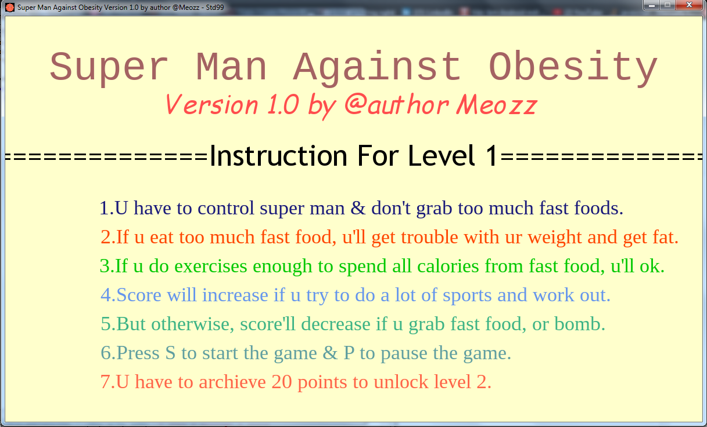
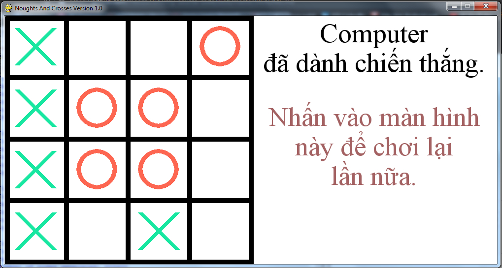

# *Personal Portfolios*
## Game Superman Against Obesity (Using PyGame)
<p align="center">
  
</p>

### How-to Run & Deploy

1. Install Python 3.x (recommended) or other version from [here](https://www.python.org/downloads/).

2. Clone the repository by typing in cmd:

```bash
$ git clone https://github.com/meozz2109/my-source-code.git
```

or download as zip and extract it.

3. Install PyGame 1.9.x from [here](http://www.pygame.org/download.shtml) or in the root directory run:

```bash
$ pip install pygame
```

4. Go into Pygame-Superman folder by typing:

```bash
$ cd Pygame-Superman/
```

5. Run game in command prompt or command line (cmd) or IDLE by typing:

```bash
$ python SuperManVersion0.py
```

6. Use <kbd>&uarr;</kbd> or <kbd>&larr;</kbd> or <kbd>&rarr;</kbd> or <kbd>&darr;</kbd> key to play and <kbd>Esc</kbd> to close the game.

7. The following picture shows the first UI of the this game:
[](https://github.com/meozz2109/my-source-code/)

8. ****Have fun!****


# *College Portfolios*
* 1.Currency Converter
* 2.Algorithm Illustration
* 3.Noughts And Crosses 64 board And Chess With AI
* 4.Restaurant Management Application
## 1.Currency Converter
* This application 've been created by using Java Swing (pull or drop items).
* With a purpose of converting a small amount of country currency among each others.
* Language of this application is applied for Vietnamese only.
* For instance: Vietnam Dong (VND), United State Dollar (USD), Korean Won (KRW), Europe (EUR), Bitcoin (XBT), etc.
* The following picture shows a screen of this application and how is this application look like:
[](https://github.com/meozz2109/my-source-code/) 
## 2.Algorithm Illustration
* This application 've been created by using Java Swing without pulling or dropping.
* Language of this application is applied for Vietnamese only.
* With a purpose of figuring out 2 algorithms in terms of CPU scheduling: ``SJF`` - **Shortest Job First** and disk scheduling: ``SSTF``- **Shortest Seek Time First**.
* The following piture shows a beginning screen of this application:
[](https://github.com/meozz2109/my-source-code/)
## 3.Noughts and Crosses 16 Boards (4x4) With AI Using Pygame
<p align="center">
  
</p>

### How-to Run & Deploy

1. Install Python 3.x (recommended) or other version from [here](https://www.python.org/downloads/)

2. Clone the repository by typing in cmd:

```bash
$ git clone https://github.com/meozz2109/my-source-code.git
```

or download as zip and extract it.

3. Install PyGame 1.9.x from [here](http://www.pygame.org/download.shtml) or in the root directory run:

```bash
$ pip install pygame
```

4. Go into NoughtsAndCrosses4x4 folder by typing:

```bash
$ cd NoughtsAndCrosses4x4/
```

5. Run game in command prompt or command line (cmd) or IDLE by typing:

```bash
$ python MinimaxNoughtsAndCrosses4x4.py
```

6. ****Enjoy the game!****


* This application 've used Minimax Algorithm and Alpha-Beta Pruning.
* This below picture is a screenshot of this game at the begining, and the language of this game is Vietnamese only:
[](https://github.com/meozz2109/my-source-code/)
* Another image show main screen of the application: 
[](https://github.com/meozz2109/my-source-code/)

## 4.Restaurant Management Application
* This application have been created by using C# and WPF (Window Presentation Foundation) Framework.
* This application is displayed with 2 languages: Vietnamese and English.
* The following picture shows the first interface (User interface) of this application:
* Below picture shows the Log In screen of this application:
* Three actors that usually use this system are: Manager, Stock manager and Cashier.
* The first screen of logging in with Manager's privilege:
* The second screen with the same privilege:
* The third screen that shows the Write Report features:
* If you log in with Stock Manager's privilege, this below picture shows the first screen:
* With the same privilege, the following picture display the second screen:
* Or with Cashier's privilege, you could see the UI like this picture:
* Etc.
