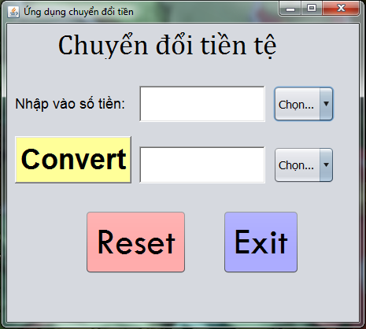
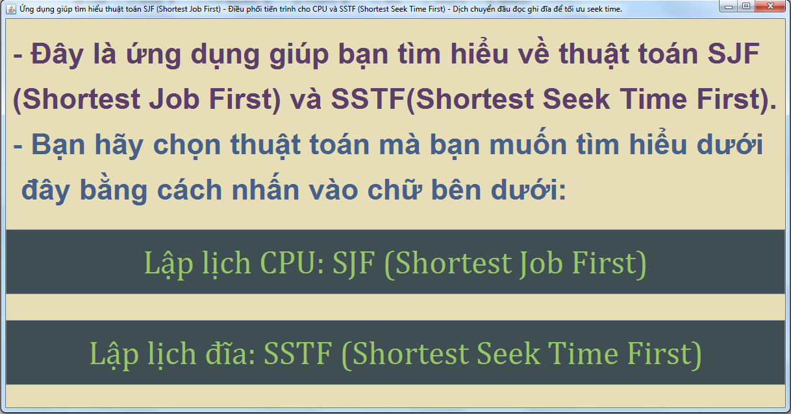

# *Personal Portfolios*
## Game Superman (Using PyGame)
<p align="center">
  
</p>

### How-to Run & Deploy

1. Install Python 3.x (recommended) or other version from [here](https://www.python.org/downloads/)

2. Clone the repository by typing in cmd:

```bash
$ git clone https://github.com/meozz2109/my-source-code.git
```

or download as zip and extract it.

3. Install PyGame 1.9.x from [here](http://www.pygame.org/download.shtml) or in the root directory run:

```bash
$ pip install pygame
```
4. Run game in command prompt or command line (cmd) or IDLE by typing:

```bash
$ python SuperManVersion0.py
```
5. Use <kbd>&uarr;</kbd> or <kbd>&larr;</kbd> or <kbd>&rarr;</kbd> or <kbd>&darr;</kbd> key to play and <kbd>Esc</kbd> to close the game.

6. ****Have fun!****


# *College Portfolios*
* Currency Converter
* Algorithm Illustration
* Noughts And Crosses 64 board And Chess With AI
* Restaurant Management App
## Currency Converter
* This application 've been created by using Java Swing (pull or drop items).
* With a purpose of converting a small amount of country currency among each others.
* For instance: Vietnam Dong (VND), United State Dollar (USD), Korean Won (KRW), Europe (EUR), Bitcoin (XBT), etc.
* The following picture shows a screen of this application and how is this application look like:
[](https://github.com/meozz2109/my-source-code/) 
## Algorithm Illustration
* This application 've been created by using Java Swing without pulling or dropping.
* With a purpose of figuring out 2 algorithms in terms of CPU scheduling: ``SJF`` - **Shortest Job First** and disk scheduling: ``SSTF``- **Shortest Seek Time First**.
* The following piture shows a beginning screen of this application:
[](https://github.com/meozz2109/my-source-code/)
## Noughts and Crosses 64 Boards And Chess With AI
