# *Personal Portfolios*
## Game Superman Against Obesity (Using PyGame)
<p align="center">
  
</p>

### How-to Run & Deploy

1. Install Python 3.x (recommended) or other version from [here](https://www.python.org/downloads/).

2. Clone the repository by typing in cmd:

```bash
$ git clone https://github.com/meozz2109/my-source-code.git
```

or download as zip and extract it.

3. Install PyGame 1.9.x from [here](http://www.pygame.org/download.shtml) or in the root directory run:

```bash
$ pip install pygame
```

4. Go into Pygame-Superman folder by typing:

```bash
$ cd Pygame-Superman/
```

5. Run game in command prompt or command line (cmd) or IDLE by typing:

```bash
$ python SuperManVersion0.py
```

6. Use <kbd>&uarr;</kbd> or <kbd>&larr;</kbd> or <kbd>&rarr;</kbd> or <kbd>&darr;</kbd> key to play and <kbd>Esc</kbd> to close the game.

7. The following picture shows the first UI of the this game:
[](https://github.com/meozz2109/my-source-code/)

8. ****Have fun!****


# *College Portfolios*
* 1.Currency Converter
* 2.Algorithm Illustration
* 3.Noughts And Crosses 64 board And Chess With AI
* 4.Restaurant Management Application
## 1.Currency Converter
* This application 've been created by using Java Swing (pull or drop items).
* With a purpose of converting a small amount of country currency among each others.
* Language of this application is applied for Vietnamese only.
* For instance: Vietnam Dong (VND), United State Dollar (USD), Korean Won (KRW), Europe (EUR), Bitcoin (XBT), etc.
* The following picture shows a screen of this application and how is this application look like:
[](https://github.com/meozz2109/my-source-code/) 
## 2.Algorithm Illustration
* This application 've been created by using Java Swing without pulling or dropping.
* Language of this application is applied for Vietnamese only.
* With a purpose of figuring out 2 algorithms in terms of CPU scheduling: ``SJF`` - **Shortest Job First** and disk scheduling: ``SSTF``- **Shortest Seek Time First**.
* The following piture shows a beginning screen of this application:
[](https://github.com/meozz2109/my-source-code/)
## 3.Noughts and Crosses 16 Boards (4x4) With AI Using Pygame
<p align="center">
  
</p>

### How-to Run & Deploy

1. Install Python 3.x (recommended) or other version from [here](https://www.python.org/downloads/)

2. Clone the repository by typing in cmd:

```bash
$ git clone https://github.com/meozz2109/my-source-code.git
```

or download as zip and extract it.

3. Install PyGame 1.9.x from [here](http://www.pygame.org/download.shtml) or in the root directory run:

```bash
$ pip install pygame
```

4. Go into NoughtsAndCrosses4x4 folder by typing:

```bash
$ cd NoughtsAndCrosses4x4/
```

5. Run game in command prompt or command line (cmd) or IDLE by typing:

```bash
$ python MinimaxNoughtsAndCrosses4x4.py
```

6. ****Enjoy the game!****


* This application 've used Minimax Algorithm and Alpha-Beta Pruning.
* This below picture is a screenshot of this game at the begining, and the language of this game is Vietnamese only:
[](https://github.com/meozz2109/my-source-code/)
* Another image show main screen of the application: 
[](https://github.com/meozz2109/my-source-code/)

## 4.Restaurant Management Application
* This application have been created by using C# and WPF (Window Presentation Foundation) Framework.
* This application is displayed with Vietnamese.
* The following picture shows the first interface (User interface) of this application:
[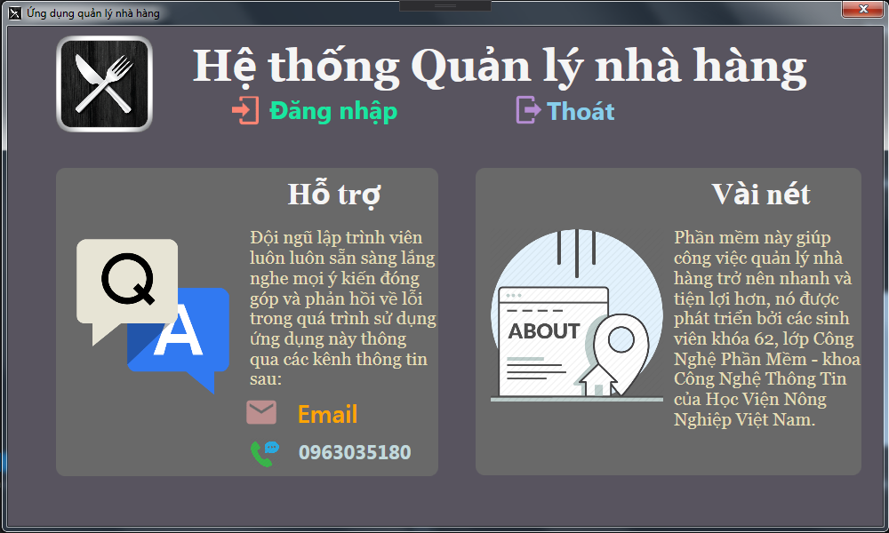](https://github.com/meozz2109/my-source-code/)
* Below picture shows the Log In screen of this application:
[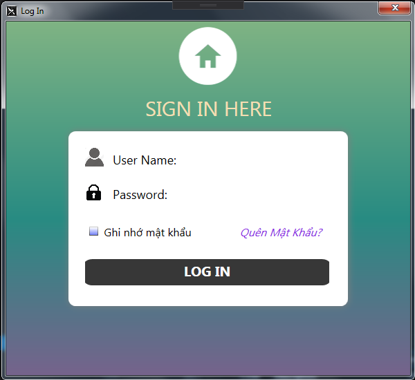](https://github.com/meozz2109/my-source-code/)
* Three actors that usually use this system are: Manager, Stock manager and Cashier.
* The first screen of logging in with Manager's privilege:
[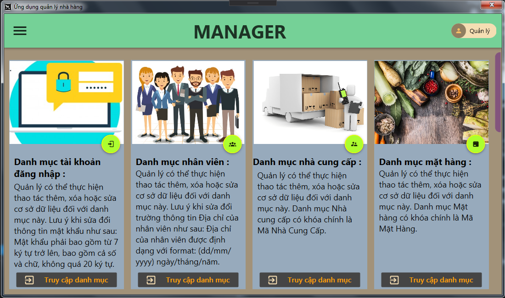](https://github.com/meozz2109/my-source-code/)
* The second screen with the same privilege:
[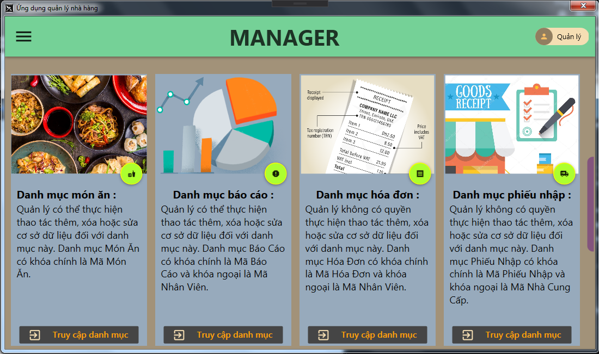](https://github.com/meozz2109/my-source-code/)
* The third screen with the same privilege as well:
[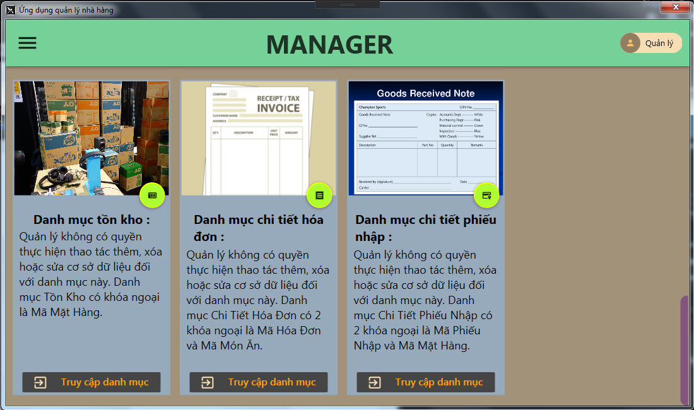](https://github.com/meozz2109/my-source-code/)
* If you log in with Stock Manager's privilege, this below picture shows the first screen:
[](https://github.com/meozz2109/my-source-code/)
* With the same privilege, the following picture display the Write Report feature:
[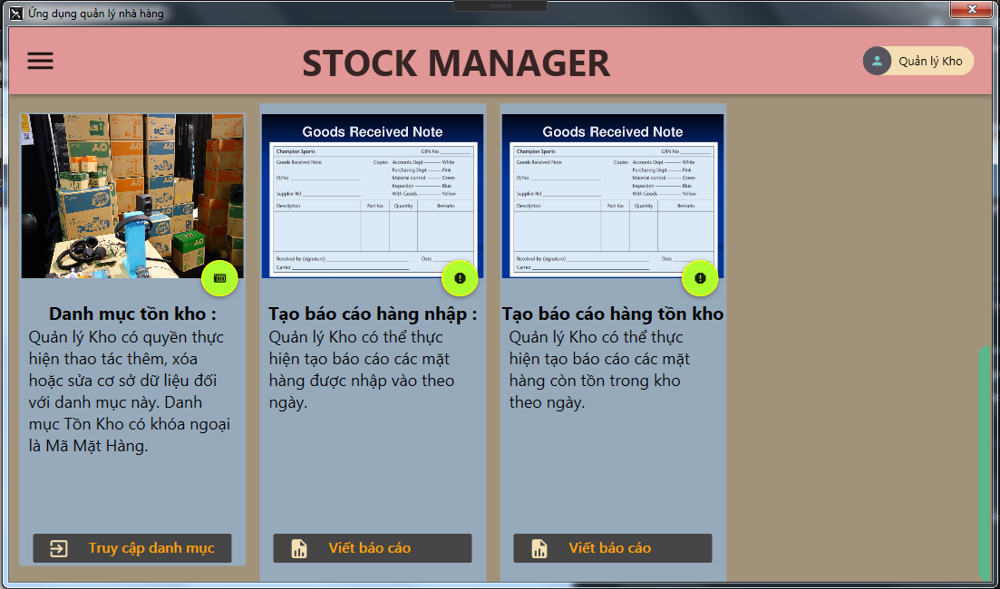](https://github.com/meozz2109/my-source-code/)
* Or with Cashier's privilege, you could see the UI like this picture:
[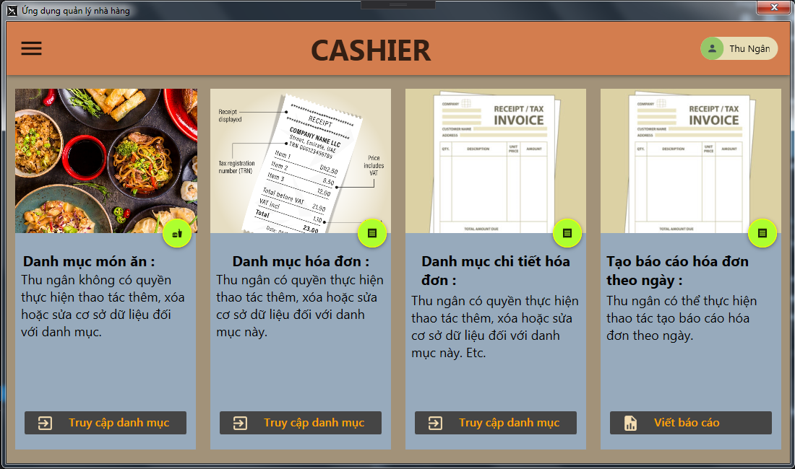](https://github.com/meozz2109/my-source-code/)

### How to Run & Deploy Project:

1. Go into Restaurant Management Application folder by typing:

```bash
$ cd Restaurant Management Application/
```

2. Run the application by double-clicking to the RestaurantManagementApplication.exe

3. Have fun!

## 5.Distinguish Cat & Dog Through Facial Recognization Application

## 6.Library Management Application
* This application have been created by using Java and Swing in conjunction with JavaFX Framework.
* This application is displayed with English.
* The following picture shows the first interface (User interface) of this application:
[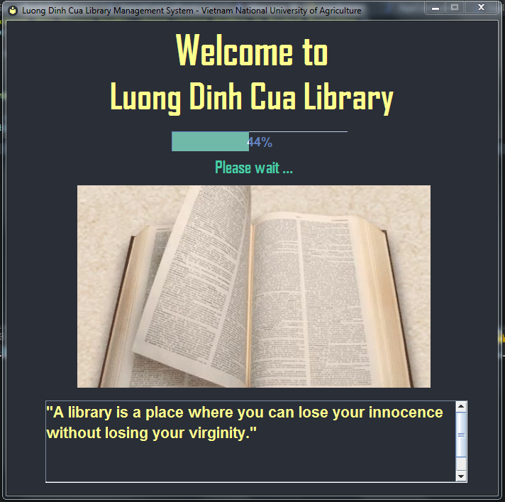](https://github.com/meozz2109/my-source-code/)
* Then, dig'in deeper in the application, a role request dialog shows up:
[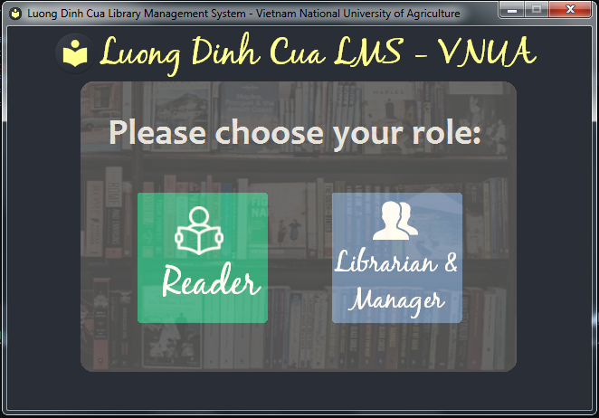](https://github.com/meozz2109/my-source-code/)
* With Reader role, the application allow user to search documents via title, name, and publish year, also monitor the manual and policy of the library:
[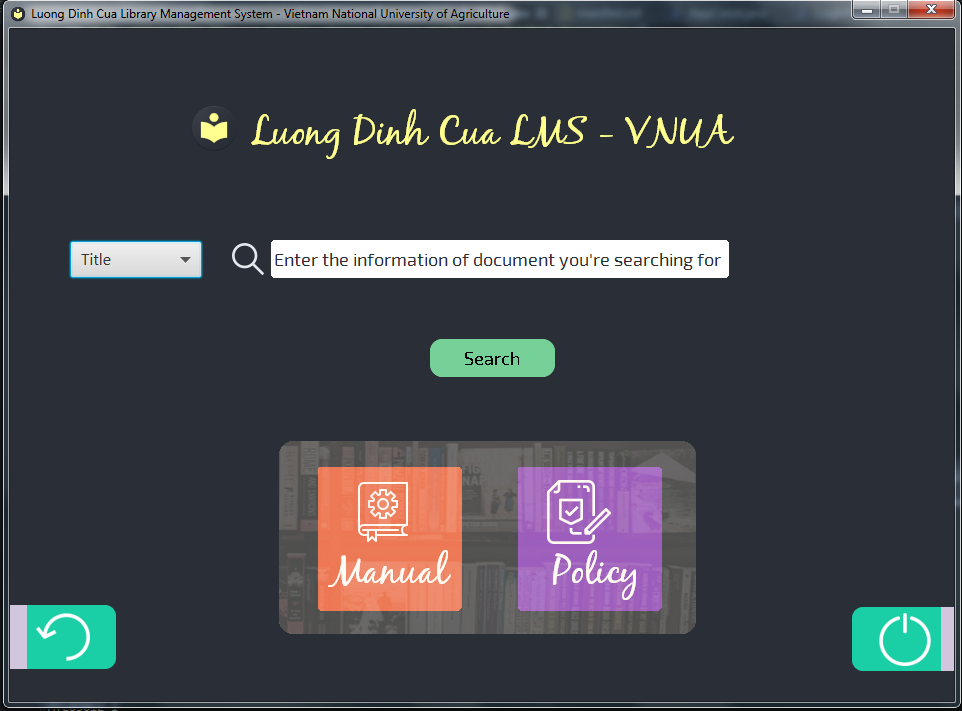](https://github.com/meozz2109/my-source-code/)
* The manual of LDC library shows up when user click to Manual button:
[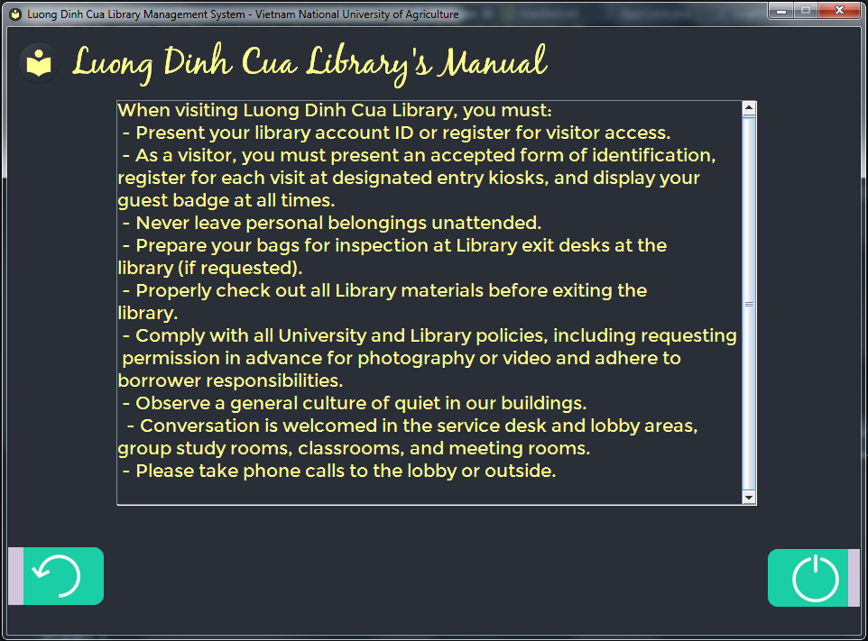](https://github.com/meozz2109/my-source-code/)
* The policy of LDC libray as well as the manual, also shows up when user click to Policy button:
[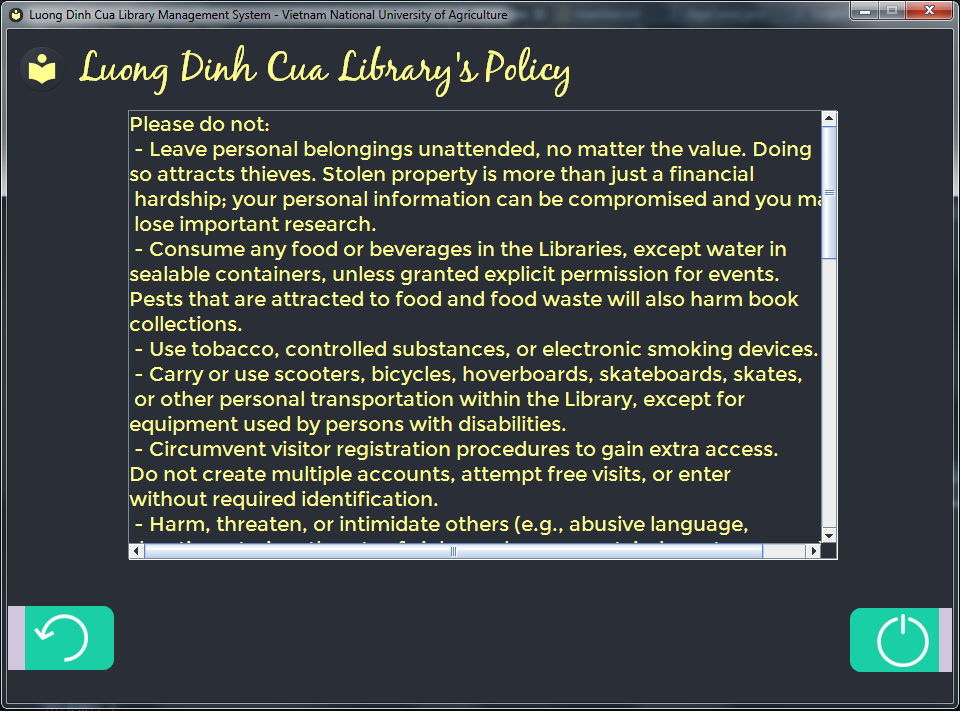](https://github.com/meozz2109/my-source-code/)
* When typing the information into the search field and click Search button, the application turn into:
[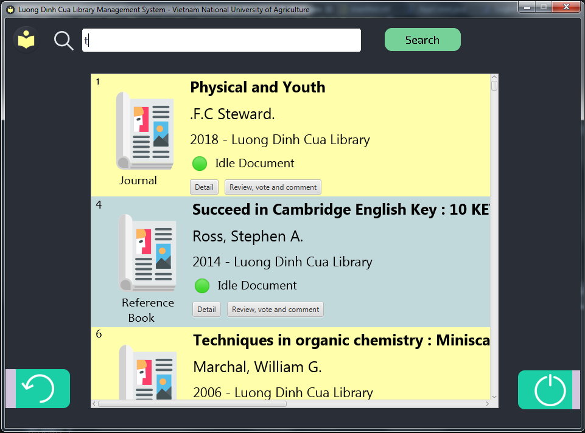](https://github.com/meozz2109/my-source-code/)
* With Librarian role, the application allow user to log in into system with 2 distinguished account includes 
### How to Run & Deploy

1. Step 1: First of all, you need to download [SQL Server version 2019](http://www.winta.com.vn/Tin-tuc/2944/-huong-dan-cai-dat-sql-server-2019.html)
via clicking in a hyperlink, then install via viewing those Instruction.
2. Step 2: After installing SQL server version 2019 successfully, you have to set up your port via the following steps:
	1. Go to SQL Server Configuration Manager.
	2. When accessing to SQL Server Configuration Manager, you need to choose SQL Server Network Configuration, then forward to choose Protocols for Name_Of_Config_SQL_Server.
	3. After clicking Protocols for Name_Of_Config_SQL_Server, we have to fix all the status into Enabled status.
	4. Click into TCP/IP, and choose IP Addresses to find IPAll, after that, fix TCP Port into 1433.
3. Step 3: Config Account for User:
	1. Access into [this hyperlink](
	https://www.qthang.net/2020/03/huong-dan-bat-tai-khoan-sa-trong-sql-server.html) to set up account for User.
	2. Naming convention: Login name is named "sa" and Password 's set to "123456789".
4. Step 4: Next, you need to access into the following folder build/SQL/, then import file ldc_lms_manage_sys.sql in SQL server via following the instruction of [this hyperlink](https://atpweb.vn/blog/huong-dan-cac-cach-import-file-sql-vao-sql-server-moi-nhat-2020/).
	1. Or another solution in case that the first one is not working, Restore the SQL Server: access into SQL Server Management Studio, log in to CSDL SQL, then click to Databases, double click to choose Restore Database… 
	2. Next, when the window show up, at its main interface , instead of choosing From database, you have to choose From device, afterwards clicking the Button … at the end of its main interface.
	3. Finally, at small showed up window, you click the button Add to choose the file which has .bak at the folder build/SQL/, and click OK to accept Restore the database. 
5. Step 5: Then, you have to set up the [Java environment](https://o7planning.org/vi/10377/huong-dan-cai-dat-va-cau-hinh-java) via clicking above hyperlink, then follow the instruction to install it.
6. Step 6: You need to access into D:/ inside your computer using Window , create 1 folder whose name is LMS_Required, after that extract the file .zip whose name is Font_Sys.zip , Jar_Lib.zip and Images_Sys.zip within this folder, for setting up the applicaiton 's resources.
7. Final step - Step 7: Click to access the folder build/App Bundle/Runable/ and choose to double click the file .exe to run the program.
	1. Whether or not during the executing, application crashes occur, then you have to access to Start, click to find bar to search "cmd" and click Enter. 
	2. Command line window showed up, you have to copy the URL that link to file .jar and .exe,
	3. After that, you need to figure that what drive you currently use, in case that current drive is D drive, you type in "D:", then do this command : 

	```bash
	$ cd Path	
	```
	with path is the URL that you 've currently copy, fast command is cd + Paste.
	4. Next, you do the command :  
	```bash
	$ java -jar ldc_lms_runable.jar	
	```
	to execute the application.
